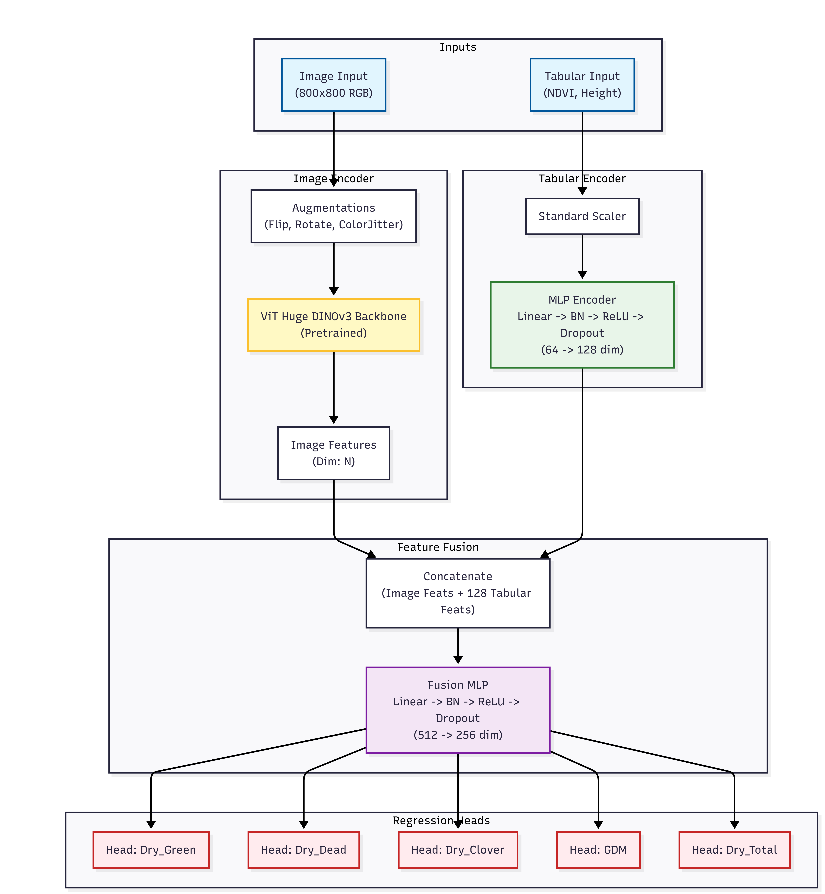
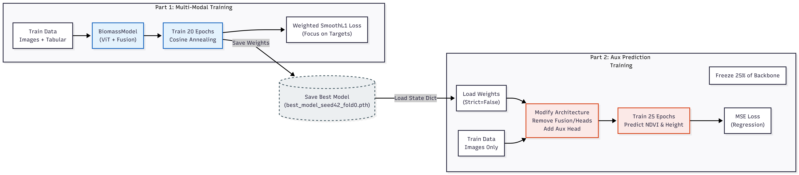

# 🏆 Kaggle CSIRO Pasture Biomass Prediction - 4th Place Solution

[](https://www.kaggle.com/competitions/csiro-biomass/writeups/vit-huge-dinov3-and-multi-modal-feature-fusion)
[](https://www.python.org/)
[](https://pytorch.org/)
[](LICENSE)

> **ViT-Huge DINOv3 & Multi-Modal Feature Fusion with Auxiliary Prediction**

First, a huge thank you to the organizers for hosting this challenge and to my fellow competitors. Sharath and I are thrilled to achieve the **4th position (Gold Medal 🥇)**. Our solution relies on a heavy Vision Transformer backbone initialized with DINOv3 weights, a multi-modal fusion strategy combining images with tabular data, and a critical data cleaning pipeline.

---

## 📑 Table of Contents

- [Overview](#overview)
- [Key Results](#-key-results)
- [Project Structure](#-project-structure)
- [Solution Details](#solution-details)
  - [Data Preprocessing](#1-data-preprocessing-the-cardboard-cleanup)
  - [Main Model Architecture](#2-main-model-architecture)
  - [Auxiliary Task Training](#3-the-secret-sauce-auxiliary-task-training)
  - [What Didn't Work](#4-what-didnt-work-the-graveyard)
  - [Training Configuration](#5-training-configuration)
- [Usage](#-usage)
- [Acknowledgments](#-acknowledgments)

---

## Overview

This repository contains our **Gold Medal winning solution** for the CSIRO Pasture Biomass Prediction competition on Kaggle. The task was to predict biomass measurements from pasture images combined with tabular sensor data.

### 🎯 Key Results

| Stage | Public LB | Private LB |
|-------|-----------|------------|
| Baseline | 0.74 | 0.64 |
| + Data Cleaning | 0.75 | 0.65 |
| + Auxiliary Training | **0.76** | **0.66** |

---

### Requirements

- Python 3.10+
- PyTorch 2.8.0+cu126
- timm 1.0.22
- albumentations
- scikit-learn
- pandas
- numpy
- opencv-python
- tqdm

---

## 📁 Project Structure

```
├── train/
│   ├── main_model.py      # Stage 1: Main biomass regression model
│   └── aux_model.py       # Stage 2: Auxiliary feature prediction
├── prediction-with-aux.ipynb  # Inference notebook
├── README.md
└── requirements.txt
```

---

## Solution Details

### 1. Data Preprocessing: The "Cardboard" Cleanup

Before touching the model architecture, we realized a significant portion of the image data contained irrelevant noise—specifically, the cardboard backing used in the data collection process.

- **Manual Cropping:** My teammate and I manually reviewed the dataset and cropped out the cardboard edges from the pasture images. This ensured the model focused purely on the biomass (grass/clover) rather than learning artifacts from the background.

- **Impact:** This step was crucial. It provided a clear boost of **+0.01** on both leaderboards:
  - Public LB: 0.74 → **0.75**
  - Private LB: 0.64 → **0.65**

---
        

### 2. Main Model Architecture

Our main approach was a **Multi-Modal Regression Network**. We treated the problem as a fusion of visual data (pasture images) and physical measurements (Height/NDVI).

#### Architecture Diagram

<p align="center">
  
</p>

#### Key Components

| Component | Description |
|-----------|-------------|
| **Backbone** | `vit_huge_plus_patch16_dinov3.lvd1689m` - Self-supervised DINOv3 weights with first 50% layers frozen |
| **Fusion Strategy** | `Pre_GSHH_NDVI` and `Height_Ave_cm` encoded via 2-layer MLP, concatenated with ViT global avg pooling features |
| **Loss Function** | `WeightedSmoothL1Loss` with weights `[0.1, 0.1, 0.1, 0.2, 0.5]` prioritizing Total and GDM targets |

---
    

### 3. The "Secret Sauce": Auxiliary Task Training

A major boost came from a secondary training stage where we repurposed the trained backbone to predict the *tabular features* from the images.

#### Auxiliary Pipeline Diagram

<p align="center">
  
</p>

- **Logic:** By forcing the model to predict `NDVI` and `Height` solely from the RGB image, the backbone learned robust features correlated with plant health and density that the primary regression heads might have missed.

- **Initialization:** This model was initialized with the **best weights from Fold 0** of the main training loop, essentially acting as a domain-specific fine-tuner.

- **Impact:** This auxiliary training provided the final push for the Gold Medal, adding another **+0.01** to both scores:
  - Final Public LB: **0.76**
  - Final Private LB: **0.66**

---
        

### 4. What Didn't Work (The Graveyard)

Despite the success, many ideas were left on the cutting room floor.

| Approach | Result |
|----------|--------|
| Pure MSE, Quantile Loss, Log Loss | Failed to beat SmoothL1 |
| Direct R² optimization | Underperformed |
| Log transformation of targets | Reduced performance |
| Scaled Sigmoid outputs | Reduced performance |
| Image size > 800×800 | Diminishing returns + OOM errors |
| Dual-image input | No improvement |

#### The "Promising but Failed" Architecture: Hybrid Texture Pooling

We experimented with a custom pooling layer designed to reconstruct spatial grids from ViT tokens and pool across the height dimension (simulating a scan). While the validation loss looked very promising, it did not generalize as well to the private leaderboard.

<details>
<summary>Click to expand code</summary>

```python
class HybridTexturePooling(nn.Module):
    def __init__(self, embed_dim=1280, patch_size=16, num_extra_tokens=5):
        super().__init__()
        self.ps = patch_size
        self.num_extra_tokens = num_extra_tokens
        # Projection layer: maps ViT embedding to pixel-space (ps**2) * 2
        self.projection = nn.Linear(embed_dim, (patch_size ** 2) * 2)

    def forward(self, x, h, w):
        # x: [BS, N_tokens, Dim]
        # 1. Slice off CLS + Register tokens
        patch_tokens = x[:, self.num_extra_tokens:, :] 
        
        # 2. Project to pixel-like space
        x = self.projection(patch_tokens) 
        
        bs = x.shape[0]
        h_patches, w_patches = h // self.ps, w // self.ps
        
        # 3. Reconstruct Spatial Grid
        # Reshape to (BS, H_p, W_p, PS, PS, 2)
        x = x.view(bs, h_patches, w_patches, self.ps, self.ps, 2)
        # Permute to (BS, H_p, PS, W_p, PS, 2)
        x = x.permute(0, 1, 3, 2, 4, 5).contiguous()
        # Flatten to (BS, H, W * 2)
        x = x.view(bs, h, w * 2)
        
        # 4. Mean across the Height dimension
        x = x.mean(dim=1)  # Result: [BS, 1600] for 800px input
        return x
```

</details>

---

### 5. Training Configuration

We utilized a two-stage training pipeline. Below are the specific hyperparameters used for each stage.

#### Stage 1: Main Biomass Regression

| Parameter | Value |
|-----------|-------|
| Model | `vit_huge_plus_patch16_dinov3.lvd1689m` |
| Frozen Layers | First 50% |
| Image Size | 800 × 800 |
| Batch Size | 10 |
| Optimizer | AdamW |
| Learning Rate | 5e-5 |
| Scheduler | CosineAnnealingWarmRestarts (T_0=10, T_mult=2, eta_min=1e-6) |
| Loss Function | WeightedSmoothL1Loss [0.1, 0.1, 0.1, 0.2, 0.5] |
| Validation | 5-Fold CV (Seed 42) |

#### Stage 2: Auxiliary Feature Pre-training

| Parameter | Value |
|-----------|-------|
| Objective | Predict NDVI & Height from images |
| Initialization | Best weights from Stage 1 (Fold 0) |
| Batch Size | 8 |
| Optimizer | AdamW |
| Learning Rate | 5e-5 |
| Scheduler | ReduceLROnPlateau (factor=0.5, patience=4) |
| Loss Function | MSELoss |
| Validation | 5-Fold CV (Seed 44) |

> **Note:** All regression targets and auxiliary features (tabular inputs) were normalized using `StandardScaler` prior to training to ensure stable convergence.

---

## 💻 Usage

### Training Stage 1: Main Model

```bash
cd train
python main_model.py
```

### Training Stage 2: Auxiliary Model

```bash
cd train
python aux_model.py
```

### Inference

See the `prediction-with-aux.ipynb` notebook for inference pipeline.

#### Multi-GPU Inference Strategy

To optimize inference time on Kaggle's dual-GPU environment, we implemented a **parallel multi-GPU inference pipeline** using subprocess spawning:

```
┌─────────────────────────────────────────────────────────────────┐
│                      Main Process                                │
│  ┌─────────────────────────────────────────────────────────┐    │
│  │  1. Spawn worker processes for each GPU                 │    │
│  │  2. Split test data indices across workers              │    │
│  │  3. Wait for all workers to complete                    │    │
│  │  4. Merge partial results into final submission         │    │
│  └─────────────────────────────────────────────────────────┘    │
└─────────────────────────────────────────────────────────────────┘
              │                              │
              ▼                              ▼
┌─────────────────────────┐    ┌─────────────────────────┐
│   Worker 0 (GPU 0)      │    │   Worker 1 (GPU 1)      │
│  ┌───────────────────┐  │    │  ┌───────────────────┐  │
│  │ Process 1st half  │  │    │  │ Process 2nd half  │  │
│  │ of test images    │  │    │  │ of test images    │  │
│  └───────────────────┘  │    │  └───────────────────┘  │
│           │             │    │           │             │
│           ▼             │    │           ▼             │
│  ┌───────────────────┐  │    │  ┌───────────────────┐  │
│  │ Stage 1: Aux Model│  │    │  │ Stage 1: Aux Model│  │
│  │ (Predict NDVI &   │  │    │  │ (Predict NDVI &   │  │
│  │  Height features) │  │    │  │  Height features) │  │
│  └───────────────────┘  │    │  └───────────────────┘  │
│           │             │    │           │             │
│           ▼             │    │           ▼             │
│  ┌───────────────────┐  │    │  ┌───────────────────┐  │
│  │ Stage 2: Main     │  │    │  │ Stage 2: Main     │  │
│  │ Biomass Model     │  │    │  │ Biomass Model     │  │
│  │ (with TTA)        │  │    │  │ (with TTA)        │  │
│  └───────────────────┘  │    │  └───────────────────┘  │
│           │             │    │           │             │
│           ▼             │    │           ▼             │
│   temp_part_0.csv       │    │   temp_part_1.csv       │
└─────────────────────────┘    └─────────────────────────┘
              │                              │
              └──────────────┬───────────────┘
                             ▼
                   ┌───────────────────┐
                   │  Merge & Dedupe   │
                   │  submission.csv   │
                   └───────────────────┘
```

**Key Implementation Details:**

| Component | Description |
|-----------|-------------|
| **Data Splitting** | `np.array_split(np.arange(len(test_df)), world_size)` divides samples evenly |
| **Process Spawning** | `subprocess.Popen` launches independent Python processes per GPU |
| **Device Assignment** | Each worker uses `torch.device(f'cuda:{rank}')` for its dedicated GPU |
| **Result Aggregation** | Partial CSVs merged with `pd.concat()` and deduplicated |

**Performance Benefit:** This approach effectively **halves the inference time** by running both GPUs in parallel, which is critical given the heavy ViT-Huge backbone and TTA augmentations.

---

## 🙏 Acknowledgments

- Thanks to **CSIRO** and **Kaggle** for hosting this amazing competition
- Special thanks to my teammate **Sharath** for the collaboration
- The amazing **timm** library and **DINOv3** pretrained weights

---

## 📄 License

This project is licensed under the MIT License - see the [LICENSE](LICENSE) file for details.

---

<p align="center">
  <b>If you find this solution helpful, please consider giving it a ⭐!</b>
</p>