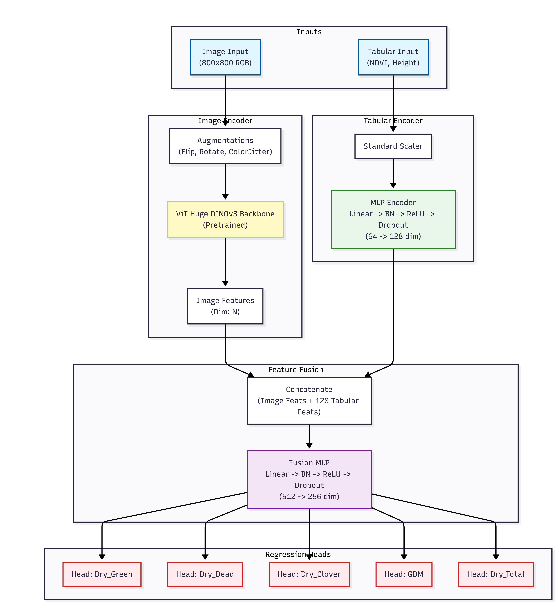
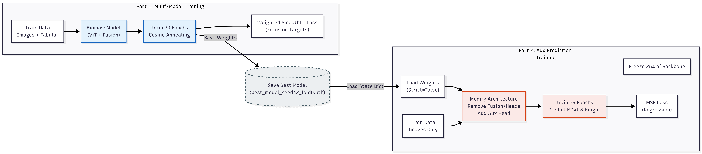

# 🏆 Kaggle CSIRO Pasture Biomass Prediction — 4th Place Solution

**ViT-Huge DINOv3 & Multi-Modal Feature Fusion with Auxiliary Prediction**

[](https://www.kaggle.com/competitions/csiro-biomass/writeups/vit-huge-dinov3-and-multi-modal-feature-fusion)
[](https://www.python.org/)
[](https://pytorch.org/)
[](LICENSE)

[](https://huggingface.co/jatinmehra/CSIRO-DinoV3-HugePlus-LB76)
[](https://huggingface.co/jatinmehra/CSIRO-AUX_MODEL)
[](https://jatinmehra-biomass-prediction.hf.space/docs)

---

First, a huge thank you to the organizers for hosting this challenge and to my fellow competitors. Sharath and I are thrilled to achieve the **4th position (Gold Medal 🥇)**. Our solution relies on a heavy Vision Transformer backbone initialized with DINOv3 weights, a multi-modal fusion strategy combining images with tabular data, and a critical data cleaning pipeline.

[Overview](#overview) · [Key Results](#-key-results) · [Solution Details](#-solution-details) · [API Deployment](#-api-deployment) · [Usage](#-usage) · [Acknowledgments](#-acknowledgments)

</div>

---

## Overview

This repository contains our **Gold Medal winning solution** for the [CSIRO Pasture Biomass Prediction](https://www.kaggle.com/competitions/csiro-biomass) competition on Kaggle. The task was to predict biomass measurements from pasture images combined with tabular sensor data.

Our approach combines:

- **ViT-Huge+** backbone with self-supervised DINOv3 pre-training
- **Multi-modal fusion** of visual and tabular features (NDVI, Height)
- **Auxiliary task training** to learn richer representations
- **Data cleaning** to remove cardboard artifacts from images

---

## 🎯 Key Results

| Stage | Public LB | Private LB | Δ |
|:------|:---------:|:----------:|:-:|
| Baseline | 0.74 | 0.64 | — |
| + Data Cleaning | 0.75 | 0.65 | +0.01 |
| + Auxiliary Training | **0.76** | **0.66** | +0.01 |

---

## 📁 Project Structure

```
.
├── train/
│   ├── main_model.py          # Stage 1: Main biomass regression model
│   └── aux_model.py           # Stage 2: Auxiliary feature prediction
├── prediction-with-aux.ipynb  # Inference notebook (Kaggle-ready)
├── requirements.txt
├── LICENSE
└── README.md
```

---

## 🔬 Solution Details

### 1. Data Preprocessing — The "Cardboard" Cleanup

Before touching the model architecture, we identified that a significant portion of the image data contained irrelevant noise—specifically, the cardboard backing used in the data collection process.

- **Manual Cropping:** We manually reviewed the dataset and cropped out the cardboard edges from the pasture images, ensuring the model focused purely on biomass content.
- **Impact:** This step alone provided a consistent **+0.01** improvement on both leaderboards.

---

### 2. Main Model Architecture

Our primary approach is a **Multi-Modal Regression Network** that fuses visual features (pasture images) with physical measurements (Height / NDVI).

<p align="center">
  
</p>

| Component | Description |
|:----------|:------------|
| **Backbone** | `vit_huge_plus_patch16_dinov3.lvd1689m` — Self-supervised DINOv3 weights, first 50% of layers frozen |
| **Fusion** | `Pre_GSHH_NDVI` and `Height_Ave_cm` encoded via a 2-layer MLP, concatenated with ViT global average pooling features |
| **Loss** | `WeightedSmoothL1Loss` with weights `[0.1, 0.1, 0.1, 0.2, 0.5]`, prioritizing Total and GDM targets |

---

### 3. The "Secret Sauce" — Auxiliary Task Training

A major boost came from a secondary training stage where we repurposed the trained backbone to predict the *tabular features* from images alone.

<p align="center">
  
</p>

| Aspect | Detail |
|:-------|:-------|
| **Logic** | Forcing the model to predict `NDVI` and `Height` solely from RGB images teaches the backbone features correlated with plant health and density |
| **Initialization** | Weights from the **best Fold 0 checkpoint** of the main model |
| **Impact** | Final push to Gold — **+0.01** on both Public and Private LB |

---

### 4. What Didn't Work

| Approach | Outcome |
|:---------|:--------|
| Pure MSE / Quantile / Log Loss | Failed to beat SmoothL1 |
| Direct R² optimization | Underperformed |
| Log transformation of targets | Reduced performance |
| Scaled Sigmoid outputs | Reduced performance |
| Image size > 800×800 | Diminishing returns + OOM |
| Dual-image input | No improvement |

<details>
<summary><b>Hybrid Texture Pooling — Promising but Failed</b></summary>

We experimented with a custom pooling layer designed to reconstruct spatial grids from ViT tokens and pool across the height dimension. While validation loss looked promising, it did not generalize to the private leaderboard.

```python
class HybridTexturePooling(nn.Module):
    def __init__(self, embed_dim=1280, patch_size=16, num_extra_tokens=5):
        super().__init__()
        self.ps = patch_size
        self.num_extra_tokens = num_extra_tokens
        self.projection = nn.Linear(embed_dim, (patch_size ** 2) * 2)

    def forward(self, x, h, w):
        patch_tokens = x[:, self.num_extra_tokens:, :]
        x = self.projection(patch_tokens)
        bs = x.shape[0]
        h_patches, w_patches = h // self.ps, w // self.ps
        x = x.view(bs, h_patches, w_patches, self.ps, self.ps, 2)
        x = x.permute(0, 1, 3, 2, 4, 5).contiguous()
        x = x.view(bs, h, w * 2)
        x = x.mean(dim=1)  # [BS, 1600] for 800px input
        return x
```

</details>

---

### 5. Training Configuration

#### Stage 1 — Main Biomass Regression

| Parameter | Value |
|:----------|:------|
| Model | `vit_huge_plus_patch16_dinov3.lvd1689m` |
| Frozen Layers | First 50% |
| Image Size | 800 × 800 |
| Batch Size | 10 |
| Optimizer | AdamW |
| Learning Rate | 5e-5 |
| Scheduler | CosineAnnealingWarmRestarts (`T_0=10`, `T_mult=2`, `eta_min=1e-6`) |
| Loss | WeightedSmoothL1Loss `[0.1, 0.1, 0.1, 0.2, 0.5]` |
| Validation | 5-Fold CV (Seed 42) |

#### Stage 2 — Auxiliary Feature Prediction

| Parameter | Value |
|:----------|:------|
| Objective | Predict NDVI & Height from images |
| Initialization | Best weights from Stage 1, Fold 0 |
| Batch Size | 8 |
| Optimizer | AdamW |
| Learning Rate | 5e-5 |
| Scheduler | ReduceLROnPlateau (`factor=0.5`, `patience=4`) |
| Loss | MSELoss |
| Validation | 5-Fold CV (Seed 44) |

> **Note:** All regression targets and auxiliary features were normalized using `StandardScaler` prior to training to ensure stable convergence.

---

## 🚀 API Deployment

The trained model is deployed as a **production-ready REST API** on Hugging Face Spaces, providing real-time biomass predictions.

### Live Endpoint

| | |
|:--|:--|
| **Base URL** | [`https://jatinmehra-biomass-prediction.hf.space`](https://jatinmehra-biomass-prediction.hf.space) |
| **Interactive Docs** | [`/docs`](https://jatinmehra-biomass-prediction.hf.space/docs) (Swagger UI) |
| **OpenAPI Spec** | [`/openapi.json`](https://jatinmehra-biomass-prediction.hf.space/openapi.json) |

### API Reference

#### `POST /predict`

Submit a pasture image along with tabular sensor data to receive biomass predictions.

**Request** — `multipart/form-data`

| Field | Type | Required | Description |
|:------|:-----|:--------:|:------------|
| `file` | `file` | ✅ | Pasture image (JPEG/PNG) |
| `ndvi` | `float` | ✅ | Pre-GSHH NDVI reading |
| `height` | `float` | ✅ | Average canopy height (cm) |

**Example — cURL**

```bash
curl -X POST "https://jatinmehra-biomass-prediction.hf.space/predict" \
  -F "file=@pasture_sample.jpg" \
  -F "ndvi=0.65" \
  -F "height=12.3"
```

**Example — Python**

```python
import requests

url = "https://jatinmehra-biomass-prediction.hf.space/predict"

with open("pasture_sample.jpg", "rb") as img:
    response = requests.post(
        url,
        files={"file": ("pasture_sample.jpg", img, "image/jpeg")},
        data={"ndvi": 0.65, "height": 12.3},
    )

predictions = response.json()
print(predictions)
```

**Response** — `application/json`

```json
{
  "predictions": {
    "Clover": 12.34,
    "Grass": 45.67,
    "Weeds": 3.21,
    "Total": 61.22,
    "GDM": 58.01
  }
}
```

### Deployment Architecture

```
                        ┌──────────────────────────────┐
                        │      Hugging Face Spaces      │
                        │   (Docker / Gradio Backend)   │
                        │                              │
  HTTP Request ────────▶│  ┌────────────────────────┐  │
  (Image + Tabular)     │  │   FastAPI / Gradio API  │  │
                        │  └──────────┬─────────────┘  │
                        │             │                │
                        │  ┌──────────▼─────────────┐  │
                        │  │   Preprocessing Layer   │  │
                        │  │  • Image resize (800²)  │  │
                        │  │  • StandardScaler       │  │
                        │  └──────────┬─────────────┘  │
                        │             │                │
                        │  ┌──────────▼─────────────┐  │
                        │  │   Stage 1: Aux Model    │  │
                        │  │  Predict NDVI & Height  │  │
                        │  │  (enriched features)    │  │
                        │  └──────────┬─────────────┘  │
                        │             │                │
                        │  ┌──────────▼─────────────┐  │
                        │  │   Stage 2: Main Model   │  │
                        │  │  ViT-Huge+ DINOv3       │  │
                        │  │  + Multi-Modal Fusion   │  │
                        │  └──────────┬─────────────┘  │
                        │             │                │
  JSON Response ◀───────│  ┌──────────▼─────────────┐  │
  (Biomass Predictions) │  │   Post-processing &     │  │
                        │  │   Inverse Transform     │  │
                        │  └────────────────────────┘  │
                        └──────────────────────────────┘
```

### Model Artifacts

Both model checkpoints are hosted on Hugging Face Hub and are automatically downloaded at API startup:

| Model | Hub Repository | Size |
|:------|:--------------|:-----|
| Main Model | [`jatinmehra/CSIRO-DinoV3-HugePlus-LB76`](https://huggingface.co/jatinmehra/CSIRO-DinoV3-HugePlus-LB76) | ~2.5 GB |
| Aux Model | [`jatinmehra/CSIRO-AUX_MODEL`](https://huggingface.co/jatinmehra/CSIRO-AUX_MODEL) | ~2.5 GB |

---

## 💻 Usage

### Prerequisites

```bash
pip install -r requirements.txt
```

### Requirements

| Package | Version |
|:--------|:--------|
| Python | ≥ 3.10 |
| PyTorch | ≥ 2.8.0+cu126 |
| timm | ≥ 1.0.22 |
| albumentations | latest |
| scikit-learn | latest |
| pandas | latest |
| numpy | latest |
| opencv-python | latest |
| tqdm | latest |

### Training

```bash
# Stage 1: Train the main biomass regression model (5-fold CV)
cd train
python main_model.py

# Stage 2: Train the auxiliary feature prediction model
python aux_model.py
```

### Inference

Refer to the [`prediction-with-aux.ipynb`](prediction-with-aux.ipynb) notebook for the full inference pipeline, including the multi-GPU strategy used on Kaggle.

<details>
<summary><b>Multi-GPU Inference Strategy</b></summary>

To optimize inference time on Kaggle's dual-GPU environment, we implemented a **parallel inference pipeline** using subprocess spawning:

```
┌───────────────────────────────────────────────────────────────┐
│                       Main Process                            │
│   1. Spawn worker processes for each GPU                      │
│   2. Split test data indices across workers                   │
│   3. Wait for all workers to complete                         │
│   4. Merge partial results into final submission              │
└───────────────────┬───────────────────────┬───────────────────┘
                    │                       │
                    ▼                       ▼
        ┌───────────────────┐   ┌───────────────────┐
        │  Worker 0 (GPU 0) │   │  Worker 1 (GPU 1) │
        │  1st half of data │   │  2nd half of data  │
        │                   │   │                    │
        │  Aux → Main → TTA │   │  Aux → Main → TTA │
        │         │         │   │         │          │
        │   temp_part_0.csv │   │   temp_part_1.csv  │
        └─────────┬─────────┘   └─────────┬──────────┘
                  │                       │
                  └───────────┬───────────┘
                              ▼
                    ┌───────────────────┐
                    │  Merge & Dedupe   │
                    │  submission.csv   │
                    └───────────────────┘
```

| Component | Description |
|:----------|:------------|
| **Data Splitting** | `np.array_split(np.arange(len(test_df)), world_size)` |
| **Process Spawning** | `subprocess.Popen` per GPU |
| **Device Assignment** | `torch.device(f'cuda:{rank}')` |
| **Result Aggregation** | `pd.concat()` with deduplication |

This approach effectively **halves inference time**, which is critical given the heavy ViT-Huge backbone combined with TTA augmentations.

</details>

---

## 🙏 Acknowledgments

- **[CSIRO](https://www.csiro.au/)** and **[Kaggle](https://www.kaggle.com/)** for hosting this competition
- My teammate **Sharath** for an outstanding collaboration
- The **[timm](https://github.com/huggingface/pytorch-image-models)** library and **DINOv3** pretrained weights
- **[Hugging Face](https://huggingface.co/)** for model hosting and API deployment infrastructure

---

## 📄 License

This project is licensed under the MIT License — see the [LICENSE](LICENSE) file for details.

---

<div align="center">

**If you find this solution helpful, please consider giving it a ⭐!**

</div>
